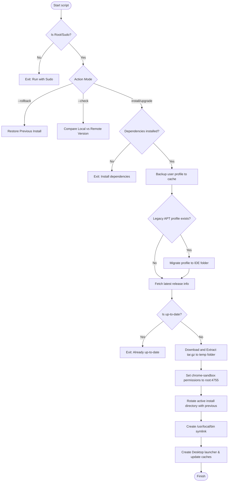

# Antigravity IDE Installer

> **Nota sobre este fork:** este repositório é um fork mantido ativamente do
> instalador original. Uso e mantenho este projeto no dia a dia para gerenciar
> minhas próprias instalações do Antigravity IDE em máquinas Ubuntu/Debian.
>
> Acompanhe o histórico de commits deste fork para ver exatamente o que foi
> alterado em relação ao upstream (`a-sajjad72/antigravity-ide-installer`).


[](LICENSE)
[](https://github.com/a-sajjad72/antigravity-ide-installer/stargazers)
[](https://github.com/a-sajjad72/antigravity-ide-installer/commits/main)
[](#supported-systems)

A community-maintained installer, updater, and manager for Google Antigravity IDE on Ubuntu and Debian-based Linux distributions. 

This utility provides a robust installation, version tracking, and safe upgrade experience for the Antigravity IDE while protecting and preserving user profiles, chats, workspace states, and extensions.

---

## Table of Contents

* [Key Features](#key-features)
* [How It Works (Architecture)](#how-it-works-architecture)
* [System Requirements](#system-requirements)
* [Installation](#installation)
  * [Quick Installation (One-liner)](#quick-installation-one-liner)
  * [Secure Installation (Recommended)](#secure-installation-recommended)
* [CLI Usage Reference](#cli-usage-reference)
* [Data Migration & Profile Backups](#data-migration--profile-backups)
* [Uninstallation](#uninstallation)
* [Credits & Acknowledgments](#credits--acknowledgments)
* [Contributing](#contributing)
* [License & Disclaimer](#license--disclaimer)

---

## Key Features

This installer includes several enhancements built on top of standard download helpers to guarantee system stability and prevent configuration loss:

* **Atomic Upgrades:** Downloads and unpacks releases into a temporary directory first. Directory naming and swapping only occur on complete success to prevent leaving the user with a broken IDE.
* **Automatic Profile Backups:** Automatically compresses your profile, chats, settings, and workspace metadata into `~/.cache/antigravity-ide-backups/` before performing upgrades.
* **Legacy APT Migration:** Detects and smoothly migrates settings from older APT repository structures (`~/.config/Antigravity`) to the new IDE location (`~/.config/Antigravity IDE`), handling lock files and file ownership.
* **Quick Rollback:** Roll back to the previously active installation instantly if a new release introduces issues.
* **Version Checking:** Verify if an upgrade is available without applying any modifications.
* **Chromium Sandbox Configuration:** Handles standard permissions (`4755` root-owned) required for the browser runtime sandbox on Linux.

---

## How It Works (Architecture)

The installer runs a series of checks, updates, and safety operations to handle the lifecycle of the IDE installation:



---

## System Requirements

The installer has been tested and supports:
* **Operating Systems:** Ubuntu 22.04 LTS, 24.04 LTS, 26.04 LTS, and general Debian-based distributions.
* **Architectures:** `x86_64` (AMD64) and `aarch64` (ARM64).
* **Dependencies:** `curl`, `tar`, and `python3` (all standard on modern Debian systems).

---

## Installation

### Quick Installation (One-liner)

Download and execute the installer script with a single command:

```bash
curl -fsSL https://raw.githubusercontent.com/a-sajjad72/antigravity-ide-installer/main/install.sh | bash
```

### Secure Installation (Recommended)

For security-conscious developers, it is best practice to download, inspect, and execute scripts in separate steps:

1. **Download the installation helper:**
   ```bash
   curl -fsSL https://raw.githubusercontent.com/a-sajjad72/antigravity-ide-installer/main/install.sh -o install-antigravity.sh
   ```
2. **Review the contents:**
   ```bash
   cat install-antigravity.sh
   ```
3. **Execute the script:**
   ```bash
   bash install-antigravity.sh
   ```

---

## CLI Usage Reference

Once installed, use the `update-antigravity-ide` binary (located in `/usr/local/bin`) to manage updates. Note that actions modifying `/opt/` or global assets require `sudo` privileges.

| Command Option | Description | Example Usage |
| :--- | :--- | :--- |
| `sudo update-antigravity-ide` | Standard run: Check and install updates. | `sudo update-antigravity-ide` |
| `sudo update-antigravity-ide --check` | Query the remote server and compare local/remote versions. | `sudo update-antigravity-ide --check` |
| `sudo update-antigravity-ide --rollback` | Swap the active folder with the backup from the previous version. | `sudo update-antigravity-ide --rollback` |

---

## Data Migration & Profile Backups

* **Legacy Migration:** If you are migrating from an APT-hosted install, the script detects your existing directory at `~/.config/Antigravity` and offers to copy configuration settings, agents, active workspace sessions, and workspace storage to the updated location at `~/.config/Antigravity IDE`.
* **Safe Backups:** Before an upgrade happens, your active `~/.config/Antigravity IDE` state is compressed and archived into:
  ```text
  ~/.cache/antigravity-ide-backups/
  ```

---

## Uninstallation

To remove the Antigravity IDE and all created symlinks, launchers, and icons from your system, run the following commands:

```bash
# Remove installed binary folders and binary links
sudo rm -rf /opt/antigravity-ide
sudo rm -f /usr/local/bin/antigravity-ide
sudo rm -f /usr/local/bin/update-antigravity-ide

# Remove system desktop application launchers and icons
sudo rm -f /usr/share/applications/antigravity-ide.desktop
sudo rm -f /usr/share/icons/hicolor/512x512/apps/antigravity-ide.png

# Update desktop cache databases
sudo update-desktop-database /usr/share/applications 2>/dev/null || true
sudo gtk-update-icon-cache -q /usr/share/icons/hicolor 2>/dev/null || true
```

*Note: Your user profile settings at `~/.config/Antigravity IDE` and backups in `~/.cache/antigravity-ide-backups/` are preserved. You can remove them manually if desired.*

---

## Credits & Acknowledgments

This installer builds on standard installation patterns:
* **Original Helper Concept:** Inspired by and adapted from the [LinuxCapable Google Antigravity Installation Guide](https://linuxcapable.com/how-to-install-google-antigravity-on-ubuntu-linux/#install-antigravity-ide-on-ubuntu), which defined the initial download page parsing logic.
* **Our Custom Enhancements:** 
  * Atomic folder rotation (`.previous`, `.new`) for crash-safe updates.
  * Automated user profile backup compression.
  * Integrated version rollback system via CLI options.
  * Clean legacy APT configuration migration helper.
  * Easy-to-use updater CLI with `--check` flags.

---

## Contributing

Contributions from the developer community are highly welcome! Please refer to [CONTRIBUTING.md](CONTRIBUTING.md) for instructions on local script testing, development steps, and our pull request submission template.

---

## License & Disclaimer

* **Code License:** This installer project is licensed under the [MIT License](LICENSE).
* **Disclaimer:** This project is community-maintained and is **not** officially affiliated with Google LLC. Google and Antigravity are registered trademarks of Google LLC.
